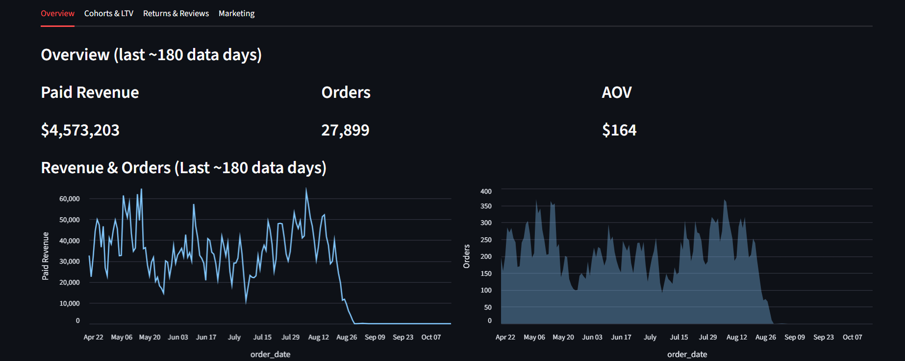
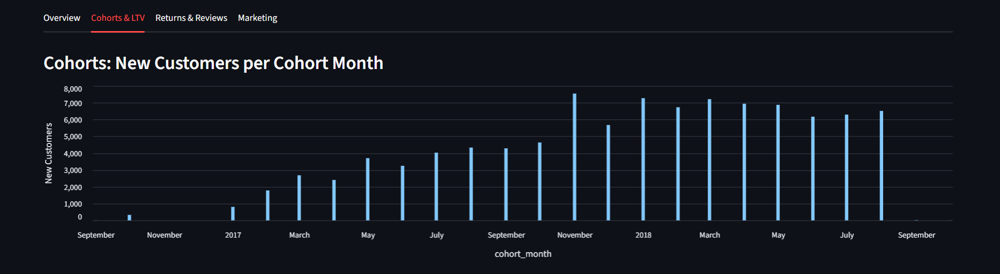

# Olist Analytics — Streamlit Dashboard

**Interactive ecommerce analytics on the public Olist dataset, delivered with a lightweight DuckDB + Streamlit stack.**  
This repo hosts the *public* application code. A separate **private** repo stores the database artifact and seeds. The app downloads the latest DuckDB file from a GitHub Release at startup (see below).

> If you’re a recruiter: jump to **[What to Notice](#what-to-notice--skills-demonstrated)**.

---

## Live App
- **Streamlit Cloud:** (https://olist-analytics-public.streamlit.app/)  
- Runs entirely on Streamlit using DuckDB (no external warehouse).

---

## Repository Layout (public)

```
.
├─ app/
│  ├─ ui.py                 # All page/tab rendering and charts (Altair)
│  ├─ db.py                 # Cached DuckDB connections + query helpers
│  ├─ config.py             # Reads Streamlit secrets (schema, paths, GH settings)
├─ tools/
│  ├─ download_db.py        # Fetches olist.duckdb from private GitHub Release
│  └─ (optional) helpers    # Local build / sanity-check utilities
├─ models/                  # Reference SQL used during development (not executed here)
├─ olist_dashboard.py       # App entry point
├─ requirements.txt         # Minimal deps (Streamlit, DuckDB, Altair, Pandas)
└─ README.md
```

> **Data is not committed** to this repo. The app downloads `olist.duckdb` from a private release at runtime.

---

## Two‑Repo Architecture

- **Public repo (this one):** Streamlit UI, query helpers, and configuration.
- **Private repo:** DuckDB database file (`olist.duckdb`) + CSV seeds and build utilities.
- **Delivery:** The private repo publishes `olist.duckdb` as a **GitHub Release asset** (tagged `v*`). The public app fetches the asset by tag on startup.

This pattern keeps source open while protecting bulk data or any proprietary marts.

---

## Features

**Overview (trailing ~180 data days)**
- Paid revenue, orders, AOV metrics
- Revenue and Orders time series (Altair)

**Cohorts & LTV**
- New customers by cohort month
- First‑month LTV by cohort
- Retention over months since cohort (heatmap)

**Returns & Reviews**
- Daily returns & average review score (1–5)
- Monthly returns + quality rollups

**Marketing ROI (optional)**
- If `marketing_spend_daily` is present, ROAS is computed
- If spend is missing, the app handles it defensively (spend shown as 0 and ROAS suppressed)

**Performance**
- DuckDB on disk, cached connections, vectorized Pandas reads
- Streamlit caching for query results to keep interactions snappy

---

## What to Notice · Skills Demonstrated

- **Data Modeling & ELT**
  - Dimensional and mart tables (sales, retention, cohort LTV, returns/quality).
  - Cohort & LTV logic (incl. fallbacks when historical months aren’t available).
- **Analytics Engineering**
  - Reproducible pipeline: source seeds → marts → single DuckDB release artifact.
  - “Two‑repo” delivery separating *code* from *data* safely.
- **Efficient Serving**
  - Single-file DuckDB (no managed warehouse), Altair viz, Streamlit caching.
- **Production‑minded**
  - Strict secrets management (Streamlit `secrets.toml`), graceful error handling.
  - Defensive behavior when optional inputs (e.g., ad spend) are absent.

---

## How the App Gets Its Data

On startup, `tools/download_db.py` does:
1. Read GitHub release info from Streamlit secrets.
2. Hit the GitHub API to find the release **tag** (e.g., `v1`) and locate the `olist.duckdb` asset.
3. Download the asset into the app working directory (path is configurable).
4. Hand back the local path so `app/db.py` can connect via DuckDB.

If the file is already present, the downloader skips the network call and uses the cached file.

---

### Screenshots

```
docs/
├─ Overview.png
├─ Cohorts.png
├─ LTV & Retention.png
├─ Returns & Reviews.png
└─ Marketing ROI.png
```





---

## Updating the Data (Private Repo Flow)

1. **Rebuild marts & DB**
   - Either via dbt in your private repo, or by running helper scripts that materialize SQL into DuckDB.
2. **Publish a release**
   - Create GitHub Release `v2` and upload the new `olist.duckdb` asset.
3. **Bump the tag**
   - In Streamlit Secrets of the public app: set `gh.tag = "v2"` and rerun the app.

---

## Tech Stack

- **Python** · **Streamlit** · **Altair** · **Pandas**
- **DuckDB** (single-file analytical DB)
- **GitHub Releases** (artifact distribution)

---

## Known Limitations

- The “Marketing ROI” tab only computes ROAS if `marketing_spend_daily` exists. If it doesn’t, spend is set to 0 and ROAS is hidden to avoid misleading results.
- The Olist public dataset has bounded history; cohorts beyond month 0 are handled gracefully when not available.

---

## License

MIT — see `LICENSE` 

---

